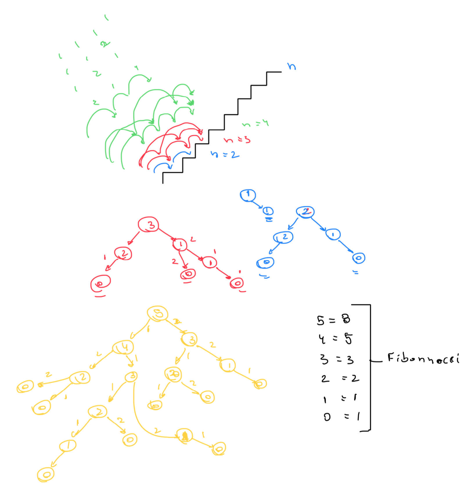

# 70. Climbing Stairs

- Link: https://leetcode.com/problems/climbing-stairs
- Level: Easy
- Added in: 24-10-10
- Topics: Math, DynamicProgramming, Memoization

## Description

You are climbing a staircase. It takes n steps to reach the top.

Each time you can either climb 1 or 2 steps. In how many distinct ways can
you climb to the top?

Example 1:
> Input: n = 2
> Output: 2
> Explanation: There are two ways to climb to the top.
> 1. 1 step + 1 step
> 2. 2 steps

Example 2:
> Input: n = 3
> Output: 3
> Explanation: There are three ways to climb to the top.
> 1. 1 step + 1 step + 1 step
> 2. 1 step + 2 steps
> 3. 2 steps + 1 step

Constraints:

- `1 <= n <= 45`

## Solutions

| Submission stats |        |
|-----------------:|:-------|
|          Runtime | 11ms (beats 76.60%) |
|           Memory | 11.49mb (beats 90.10%) |

| Exercise results |        |
|-----------------:|:-------|
|   Naive Approach | 5m28s |
|  Resolution Time | 12m21s |
|          O Space | O(n) |
|           O Time | O(n) |
|             BTTC | O(n) |

### Solution

Climbing stairs follows the same pattern as fibonacci sequence:

- 2 stairs = 2 distinct ways
- 3 stairs = 3 distinct ways
- 4 stairs = 5 distinct ways
- 5 stairs = 8 distinct ways

Therefore, the approach here is to create a recursive function
to calculate where the n position is equal to the sum of either
climbing one step or two.



```py
class Solution(object):

    cache = {}

    def climbStairs(self, n):
        """
        :type n: int
        :rtype: int
        """
        
        if n in self.cache: return self.cache[n]

        if n <= 1: return 1

        self.cache[n] = self.climbStairs(n - 1) + self.climbStairs(n - 2)

        return self.cache[n]
```