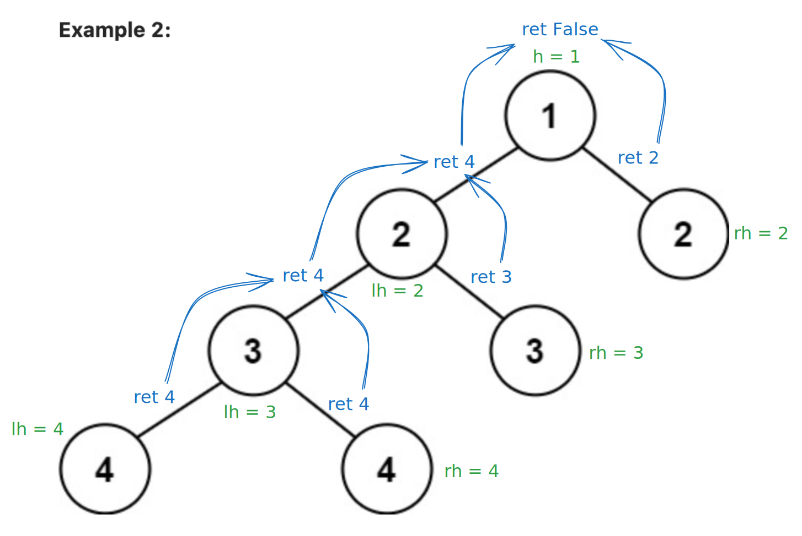

# 110. Balanced Binary Tree

- Link: https://leetcode.com/problems/balanced-binary-tree
- Level: Easy
- Added in: 24-10-09
- Topics: Tree, DepthFirstSearch, BinaryTree

## Description

Given a binary tree, determine if it is height-balanced.
A height-balanced binary tree is a binary tree in which the depth of the two 
subtrees of every node never differs by more than one.

Example 1:


```
Input: root = [3,9,20,null,null,15,7]
Output: true
```

Example 2:


```
Input: root = [1,2,2,3,3,null,null,4,4]
Output: false
```

Example 3:
```
Input: root = []
Output: true
```

## Solutions

| Submission stats |        |
|-----------------:|--------|
|          Runtime | 35ms (beats 28.28%) |
|           Memory | 17mb (beats 25.34%) |

| Exercise results |        |
|-----------------:|--------|
|      Brute Force | 10m00s |
|  Resolution Time | 15m00s |
| Complexity Space | O(M*N) |
|  Complexity Time | O(M*N) |

### Solution

The solution consists of doing a DFS (Depth-First Search) and return the 
difference between left side and right side. We go all the way down into
the tree and use `max(rh, lh)` to carry over the maximum depth of each side.

Example:



**Python3**

```py
# Definition for a binary tree node.
# class TreeNode(object):
#     def __init__(self, val=0, left=None, right=None):
#         self.val = val
#         self.left = left
#         self.right = right
class Solution(object):
    def isBalanced(self, root, h = 1):
        """
        :type root: TreeNode
        :rtype: bool
        """

        if not root: return h

        lh = self.isBalanced(root.left, h+1)

        rh = self.isBalanced(root.right, h+1)

        return abs(rh-lh) <= 1 and max(lh, rh)
```